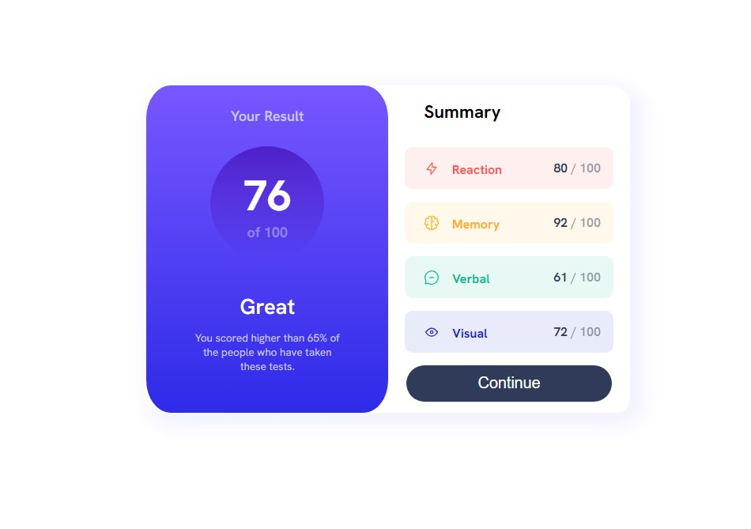
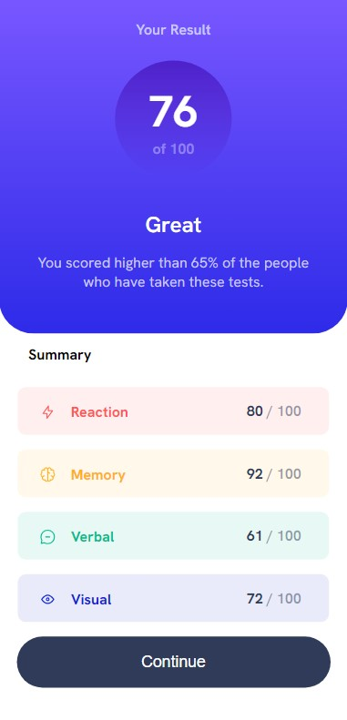

# Frontend Mentor - Results summary component solution

This is a solution to the [Results summary component challenge on Frontend Mentor](https://www.frontendmentor.io/challenges/results-summary-component-CE_K6s0maV). Frontend Mentor challenges help you improve your coding skills by building realistic projects.

## Table of contents

- [Overview](#overview)
  - [The challenge](#the-challenge)
  - [Screenshot](#screenshot)
  - [My process](#my-process)
  - [Built with](#built-with)
  - [What I learned](#what-i-learned)
  - [Continued development](#continued-development)
  - [Author](#author)

## Overview

- Took a while with this one due to work and life getting in the way. First project that had different layout/styling from browser to mobile but had an idea of how to accomplish this from the start.

### The challenge

Users should be able to:

- View the optimal layout for the interface depending on their device's screen size
- See hover and focus states for all interactive elements on the page
- **Bonus**: Use the local JSON data to dynamically populate the content

### Screenshot

## My process

- Don't really remember this as i was in and out of it.
- The usual, start with HTML, then CSS.
- Tried to use the JSON but couldnt work it out and moved on.
- First time using HSLA which was very useful to learn about!
- Started with Mobile view before moving onto Media query for Browser.

### Built with

- VSCode
- HTML
- CSS

### What I learned

- Mainly built on Laptop, had a lot of overwriting styles when doing the finer details which took a bit of time to work out.

### Continued development

- Styling tables is a right bitch and needs working on!

## Author

- Ryan Dillon
